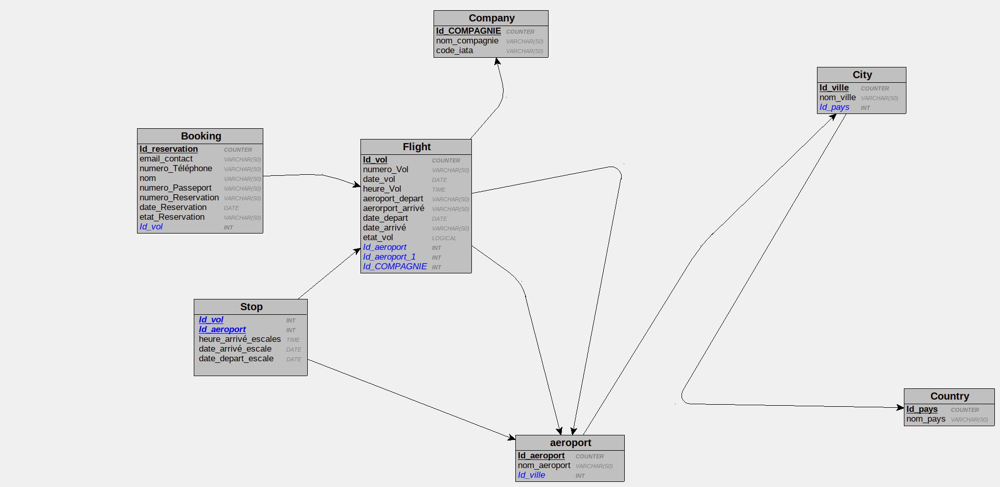

# Contexte du projet

<span class="colour" style="color:var(--text-color,#000000)">Votre client, une agence de voyages, souhaite proposer la possibilité de réserver en ligne des billets d'avion à leurs clients.</span>

<span class="colour" style="color:var(--text-color,#000000)">Votre mission est de concevoir à l'aide du standard UML la modélisation de la plateforme.</span>

<span class="colour" style="color:var(--text-color,#000000)">La plateforme devra permettre que :</span># Contexte du projet

<span class="colour" style="color:var(--text-color,#000000)">Votre client, une agence de voyages, souhaite proposer la possibilité de réserver en ligne des billets d'avion à leurs clients.</span>

<span class="colour" style="color:var(--text-color,#000000)">Votre mission est de concevoir à l'aide du standard UML la modélisation de la plateforme.</span>

<span class="colour" style="color:var(--text-color,#000000)">La plateforme devra permettre de :</span>

- Un vol est ouvert à la réservation et refermé sur ordre de la compagnie.
- Un vol peut être annulé par la compagnie
- Un client peut réserver un ou plusieurs vols, pour des passagers différents.
- Une réservation concerne un seul vol et un seul passager.
- Une réservation peut être annulée ou confirmée.
- Un vol a un aéroport de départ et un aéroport d’arrivée.
- Un vol a un jour et une heure de départ, et un jour et une heure d’arrivée.
- Un vol peut comporter des escales dans des aéroports.
- Une escale a une heure d’arrivée et une heure de départ.
- Chaque aéroport dessert une ou plusieurs villes.
- Des compagnies aériennes proposent différents vols.

## Contexte du projet 

Votre client, une agence de voyages, souhaite proposer la possibilité de réserver en ligne des billets d'avion à leurs clients.
Votre mission est de concevoir à l'aide du standard UML la modélisation de la plateforme.
La plateforme devra permettre que :

- Un vol est ouvert à la réservation et refermé sur ordre de la compagnie.
- Un vol peut être annulé par la compagnie
- Un client peut réserver un ou plusieurs vols, pour des passagers différents.
- Une réservation concerne un seul vol et un seul passager.
- Une réservation peut être annulée ou confirmée.
- Un vol a un aéroport de départ et un aéroport d’arrivée.
- Un vol a un jour et une heure de départ, et un jour et une heure d’arrivée.
- Un vol peut comporter des escales dans des aéroports.
- Une escale a une heure d’arrivée et une heure de départ.
- Chaque aéroport dessert une ou plusieurs villes.
- Des compagnies aériennes proposent différents vols.

## Critères de performance

Un readme répertoriant les informations principales.
Tous les diagrammes doivent correspondre à la notation officielle du standard UML et Merise
Les diagrammes doivent être exportés en format images facilement consultables (jpeg, png).
Minimum d'un commit par diagramme.

La conception Merise doit respecter au minimum les 3 premières formes normales.

## Livrable

### Pour la base de données

- [x] Un MCD,
- [x] Un MLD,
- [x] Un MPD.

### Pour l'application

- [x] Un dictionnaire de données,
- [x] Des règles de gestion,
- [x] Un diagramme de cas d'utilisation,
- [x] Un diagramme de classe,
- [x] Un diagramme de séquence.

## Règles de gestion
 
### Reservation
nom de la personne 
prenom de la personne
un email de contact 
un numéro de passeport
la reservation peut être annuler par l'agence
une reservation ne peut être que pour une seule personne et un seul vol
une reserveation peut être confirmée 

### Vol
Le vol contient un numero de vol 
le vol possede un aéroport de départ 
Il possede un aeroport d'arrivé 
Une date d'aeroprt de depart
une heure de départ d'aeroport
une date aeroport d'arrivée
une heure d'arrivé 
un vol peut avoir un seul ou plusieurs passagers
un vol pet être reservable 
un vol peut être annulé par la compagnie
un vol possede un numero de vol 


### Compagnie
nom de la compagnie 
code IATA de la compagnie 
La compagnie peut avoir un ou plusieurs vols 

### Escale

une escale possede une date de depart 
une escale possede une date d'arrivée 

### Aeroport
l'aeroport se trouve dans une ville 

### Ville
la ville possede un ou plusieurs aeroports 

#### Pays
Le pays possede des villes das lesquels il peut y avoir des aeroports ou non 

### Client
le client peut reserver pour lui même ou plusieurs personnes 
### Dictionnaire de données 
| Code mnémonique        | designation                                | Type   |
| ---------------------- | ------------------------------------------ | ------ |
| nom                    | nom de l'inscrit                           | A      |  |  |
| prenom                 | prenom de l'inscrit                        | A      |  |  |
| email\_contact         | l'email à contacter                        | AN     |  |  |
| numero\_passeport      | numero de passeport des personnes          | N      |  |  |
| prix                   | prix du vol                                | N      |  |  |
| date\_reservation      | date à laquelle la reservation a été faite | DATE   |  |  |
| etat\_reservation      | etat de disponibilité de la reservation    | BOLEAN |  |  |
| numero\_vol            | numero du vol                              | N      |  |  |
| aeroport\_depart       | localisation du depart du vol              | A      |  |  |
| aeroport\_arrivé       | localisation de l'arrivé du vol            | A      |  |  |
| heure\_depart          | heure du vol depart                        | N      |  |  |
| heure\_arrivé          | heure du de l'arrivée du vol               | N      |  |  |
| date\_depart           | date de depart du vol                      | DATE   |  |  |
| date\_arrivé           | date d'arrivé du vol                       | DATE   |  |  |
| etat\_vol              | etat du vol                                | N      |  |  |
| code\_IATA             | code d'identification                      | AN     |  |  |
| nom\_compagnie         | nom de la compagnie                        | A      |  |  |
| heure\_depart\_secale  | heure de l'escale de depart                | N      |  |  |
| heure\_arrivée\_escale | heure de l'escale d'arrivée                | N      |  |  |
| date\_depart\_escale   | date de depart de l'escale                 | DATE   |  |  |
| date\_arrivée\_escale  | date de l'escale d'arrivée                 | DATE   |  |  |
| nom\_aeroport          | nom de l'aeroport                          | A      |  |  |

## Modèle logique de données
**Modèle logique de données textuels**
**compagnie** = (Id_COMPAGNIE COUNTER, nom_compagnie VARCHAR(50), code_iata VARCHAR(50));
pays = (Id_pays COUNTER, nom_pays VARCHAR(50));
ville = (Id_ville COUNTER, nom_ville VARCHAR(50), #Id_pays);
**aeroport** = (Id_aeroport COUNTER, nom_aeroport VARCHAR(50), #Id_ville);
vol = (Id_vol COUNTER, numero_Vol VARCHAR(50), date_vol DATE, heure_Vol TIME, aeroport_depart VARCHAR(50), aerorport_arrivé VARCHAR(50), date_depart DATE, date_arrivé VARCHAR(50), etat_vol LOGICAL, #Id_aeroport, #Id_aeroport_1, #Id_COMPAGNIE);
**reservation** = (Id_reservation COUNTER, email_contact VARCHAR(50), numero_Téléphone VARCHAR(50), nom VARCHAR(50), numero_Passeport VARCHAR(50), numero_Reservation VARCHAR(50), date_Reservation DATE, etat_Reservation VARCHAR(50), #Id_vol);
**Escales** = (#Id_vol, #Id_aeroport, heure_arrivé_escales TIME, date_arrivé_escale DATE, date_depart_escale DATE);
[](./DATA/mld.png.jpg)

## Modèle physique de données 

```sql
CREATE TABLE Company(
   Id_company COUNTER,
   iata_code VARCHAR(50),
   company_name VARCHAR(50),
   PRIMARY KEY(Id_company)
);

CREATE TABLE Country(
   Id_country COUNTER,
   country_name VARCHAR(50),
   PRIMARY KEY(Id_country)
);

CREATE TABLE City(
   Id_city COUNTER,
   city_name VARCHAR(50),
   Id_country INT NOT NULL,
   PRIMARY KEY(Id_city),
   FOREIGN KEY(Id_country) REFERENCES Country(Id_country)
);

CREATE TABLE Airport(
   Id_airport COUNTER,
   name_airport VARCHAR(50),
   Id_city INT NOT NULL,
   PRIMARY KEY(Id_airport),
   FOREIGN KEY(Id_city) REFERENCES City(Id_city)
);

CREATE TABLE Flight(
   Id_flight COUNTER,
   flight_number VARCHAR(50),
   departure_date DATE,
   hour_Vol TIME,
   arrival_date VARCHAR(50),
   flight_status LOGICAL,
   Id_airport INT NOT NULL,
   Id_airport_1 INT NOT NULL,
   Id_company INT NOT NULL,
   PRIMARY KEY(Id_flight),
   FOREIGN KEY(Id_airport) REFERENCES Airport(Id_airport),
   FOREIGN KEY(Id_airport_1) REFERENCES Airport(Id_airport),
   FOREIGN KEY(Id_company) REFERENCES Company(Id_company)
);

CREATE TABLE Booking(
   Id_reservation COUNTER,
   contact_email VARCHAR(50),
   phone_number VARCHAR(50),
   first_name VARCHAR(50),
   passeport_number VARCHAR(50),
   booking_number VARCHAR(50),
   booking_date DATE,
   booking_status VARCHAR(50),
   Id_flight INT NOT NULL,
   PRIMARY KEY(Id_reservation),
   FOREIGN KEY(Id_flight) REFERENCES Flight(Id_flight)
);

CREATE TABLE Stop(
   Id_flight INT,
   Id_airport INT,
   departure_date DATE,
   arrival_date DATE,
   PRIMARY KEY(Id_flight, Id_airport),
   FOREIGN KEY(Id_flight) REFERENCES Flight(Id_flight),
   FOREIGN KEY(Id_airport) REFERENCES Airport(Id_airport)
);
